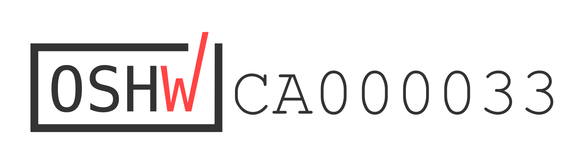

# Forest Joystick Mouse Hub

The Forest Hub enables a user to connect an analog joystick and up to four assistive switches to emulate a USB Mouse or USB Gamepad. As a USB Mouse, the joystick controls cursor movement and the assistive switches activate the left mouse button, right mouse button, middle mouse button, and scroll. As a USB Mouse, the joystick maps to the joystick/thumbstick and the assistive switches map to the joystick buttons. An additional assistive switch can be attached to the Hub to cycle between three setting slots and change the output mode between USB Mouse mode and USB Gamepad mode.

The device is comprised of a custom printed circuit board, off-the-shelf electronics, and 3D printed parts. The overall cost of materials for a single build is about $100. The individual unit cost cost is closer to $55. 

The Forest Hub is open assistive technology (OpenAT). Under the terms of the open source licenses, the device may be built, used, and improved upon by anyone.

Last updated: 2024-Apr-17
The latest version (V2.1) includes a new easier to use LED jig, updated firmware with center calibration, and updated documentation.
An updated version of the PCB and enclosure has been released (V2.0.1, 2024-Feb-20). The last version of the Forest Hub (v2.0.1) has been built and tested.

MMC Assistive Device Library Listing: https://makersmakingchange.com/s/product/forest-joystick-mouse-hub/01tJR000000E4bdYAC

## OpenAT Joysticks
This design is part of the [OpenAT Joystick Project](https://github.com/makersmakingchange/OpenAT-Joysticks), a collection of open source designs for digital access and adapted gaming.  

## How to Obtain the Device
### 1. Do-it-Yourself (DIY) or Do-it-Together (DIT)

This is an open-source assistive technology, so anyone is free to build it. All of the files and instructions required to build the device are contained within this repository. Refer to the Maker Guide below.

### 2. Request a build of this device

If you would like to obtain a Forest Hub, you may submit a build request through the [MMC Assistive Device Library Listing](https://makersmakingchange.com/s/product/forest-joystick-mouse-hub/01tJR000000E4bdYAC) to have a volunteer maker build the device. As the requestor, you are responsible for reimbursing the maker for the cost of materials and any shipping.

### 3. Build this device for someone else

If you have the skills and equipment to build this device, and would like to donate your time to create the switch for someone who needs it, visit the [MMC Maker Wanted](https://makersmakingchange.com/maker-wanted/) section.

## Build Instructions

### 1. Read through the Maker Guide

The [Maker Guide](/Documentation/Forest_Hub_Maker_Guide.pdf) contains all the necessary information to build the device.

### 2. Use the Maker Checklist
Use the Maker Checklist in the [Maker Guide](/Documentation/Forest_Hub_Maker_Guide.pdf) to confirm details and customization options with the user.

### 3. Order the Custom Printed Circuit Board (PCB)
The manufacturing files for the PCB are located in the [PCB_Build_Files](/Build_Files/PCB_Build_Files/) folder.

### 4. Order the Off-The-Shelf Components

The [Bill of Materials](/Documentation/Forest_Hub_BOM.xlsx) lists all of the parts and 3D printed components required to build the device. 

### 5. Print the 3D Printable components

The print files can be found in the [/Build_Files/3D_Printing_Files](/Build_Files/3D_Printing/) folder.

### 6.  Assemble the Device

Reference the Assembly Guide section in the [Maker Guide](/Documentation/Forest_Hub_Maker_Guide.pdf) for the tools and steps required to build the device.

## Files
### Documentation
| Document             | Version | Link |
|----------------------|---------|------|
| Design Rationale     | 2.1     | [Forest_Hub_Design_Rationale](/Documentation/Forest_Hub_Design_Rationale.pdf)     |
| Maker Guide          | 2.1     | [Forest_Hub_Maker_Guide](/Documentation/Forest_Hub_Maker_Guide.pdf)     |
| Bill of Materials    | 2.1     | [Forest_Hub_Bill_of_Materials](/Documentation/Forest_Hub_BOM.csv)     |
| User Guide           | 2.1     | [Forest_Hub_User_Guide](/Documentation/Forest_Hub_User_Guide.pdf)    |
| Changelog            | 2.1     | [Changes](Changes.txt)     |

### Design Files
 - [CAD design Files](/Design_Files/CAD_Design_Files)
 - [PCB Design Files](/Design_Files/PCB_Design_Files)

### Build Files
 - [3D Printing Files](/Build_Files/3D_Printing_Files)
 - [PCB Build Files](/Build_Files/PCB_Build_Files/)
 - [Firmware Files](/Build_Files/Firmware_Files)

## License
Copyright (c) 2023 Neil Squire Society.

This repository describes Open Hardware:
 - Everything needed or used to design, make, test, or prepare the Forest Hub is licensed under the [CERN 2.0 Weakly Reciprocal license (CERN-OHL-W v2) or later](https://cern.ch/cern-ohl ) .
 - All software is under the [GNU General Public License v3.0 (GPL-3.0)](https://www.gnu.org/licenses/gpl.html).
 - Accompanying material such as instruction manuals, videos, and other copyrightable works that are useful but not necessary to design, make, test, or prepare the Forest Hub are published under a [Creative Commons Attribution-ShareAlike 4.0 license (CC BY-SA 4.0)](https://creativecommons.org/licenses/by-sa/4.0/) .

You may redistribute and modify this documentation and make products using it under the terms of the [CERN-OHL-W v2](https://cern.ch/cern-ohl).
This documentation is distributed WITHOUT ANY EXPRESS OR IMPLIED WARRANTY, INCLUDING OF MERCHANTABILITY, SATISFACTORY QUALITY AND FITNESS FOR A PARTICULAR PURPOSE.
Please see the CERN-OHL-W v2 for applicable conditions.

Source Location: https://github.com/makersmakingchange/Forest-Joystick-Mouse-Hub

## Attribution

The [Adafruit QT Py](http://www.adafruit.com/products/4600) development board was designed by Limor Fried/Ladyada from Adafruit. The PCB design is [available open source](https://github.com/adafruit/Adafruit-QT-Py-PCB) under a CC-BY-SA license.

The concept for the Forest Hub was based on the [Enabled Controller Mini](https://github.com/milador/Enabled-Controller-Mini) by [Milador](https://github.com/milador).

### Contributors
- Jake McIvor, Neil Squire Society. Concept generation, enclosure design, schematic and PCB design, coding, documentation, testing.
- Milad Ha, Neil Squire Society. Schematic and PCB design, coding.
- Josie Versloot, Neil Squire Society. Concept generation, coding, documentation.
- Derrick Andrews, Neil Squire Society. Schematic design.
- Stephen Moyer, Neil Squire Society. Concept generation.
- Tyler Fentie, Neil Squire Society. Concept generation

## Open Source Hardware Certification

The Forest Hub has been certified as open source hardware by the Open Source Hardware Association under the OSHWA UID [CA000033](https://certification.oshwa.org/ca000033.html).

---

## About Makers Making Change

Makers Making Change is a program of [Neil Squire](https://www.neilsquire.ca/), a Canadian non-profit that uses technology, knowledge, and passion to empower people with disabilities.

Makers Making Change leverages the capacity of community based Makers, Disability Professionals and Volunteers to develop and deliver affordable Open Source Assistive Technologies.

 - Website: [www.MakersMakingChange.com](https://www.makersmakingchange.com/)
 - GitHub: [makersmakingchange](https://github.com/makersmakingchange)
 - Twitter: [@makermakechange](https://twitter.com/makermakechange)
 - Instagram: [@makersmakingchange](https://www.instagram.com/makersmakingchange)
 - Facebook: [makersmakechange](https://www.facebook.com/makersmakechange)
 - LinkedIn: [Neil Squire Society](https://www.linkedin.com/company/neil-squire-society/)
 - Thingiverse: [makersmakingchange](https://www.thingiverse.com/makersmakingchange/about)
 - Printables: [MakersMakingChange](https://www.printables.com/@MakersMakingChange)

### Contact Us
For technical questions, to get involved, or to share your experience we encourage you to [visit our website](https://www.makersmakingchange.com/) or [contact us](https://www.makersmakingchange.com/s/contact).
